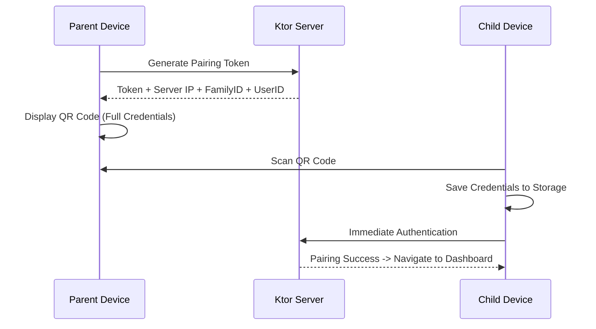
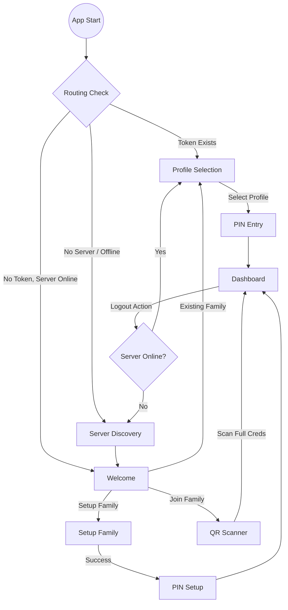
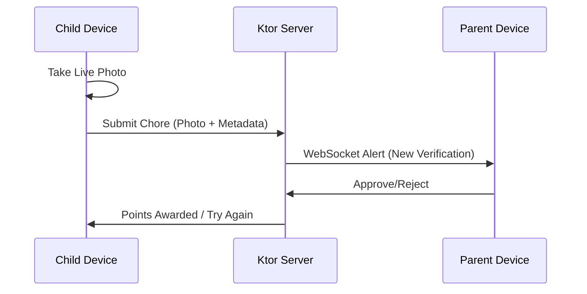

# FamilyChore: Full Project Reference & Master Plan
**Version: 1.1**

This document serves as the comprehensive "Source of Truth" for the **FamilyChore** project, consolidating vision, requirements, technical architecture, and the phased implementation roadmap.

---

## 1. Project Vision
FamilyChore is a high-engagement, gamified Kotlin Multiplatform (KMP) application designed to manage family chores locally and securely.
- **Privacy First**: No third-party cloud sync or analytics. Data stays on the home network.
- **Gamified Economy**: Points-based reward system with parental oversight.
- **Offline-First**: Mobile clients work without active internet, syncing with the local Ktor server when available.

---

## 2. Technical Stack
- **Languages**: Kotlin (100%).
- **UI**: Compose Multiplatform (Android, iOS, JVM).
- **Architecture**: MVI (State, Action, Event) with a strict Root/Screen composable split.
- **Dependency Injection**: Koin.
- **Database**: Room KMP (Single Source of Truth).
- **Networking**: Ktor (Client & Server) + WebSockets for real-time alerts.
- **Build System**: Gradle with custom Convention Plugins in `:build-logic`.
- **Testing**: JUnit5, AssertK, Turbine, Ktor MockEngine.

---

## 3. Core Architectural Principles
1. **Multi-Tenancy**: Every database entity and API request is scoped via `familyId`.
2. **Role-Based UX**: The app binary is unified, but UI branches into `Parent` or `Child` dashboards upon authentication.
3. **SSOT**: Room is the single source of truth; networking only updates the database.
4. **Local Network Discovery**: Automated scanning (mDNS) or QR-based IP exchange for server pairing.
5. **Mandatory PIN Protection**: Security gating where every app session start requires user selection and PIN verification, even if an auth token exists.

---

## 4. Architecture Diagrams

### A. Phased Onboarding (QR Handshake)

### B. App Startup & Session Flow

### C. Chore Verification Flow

---

## 5. Detailed Implementation Roadmap

### Phase 1-5: Foundation (COMPLETED)
- Build logic, `Result` wrappers, `SafeCall`, `UiText`, and Room/Ktor factory setup.

### Phase 6: Onboarding & Secure Pairing (COMPLETED)
- **Server Discovery**: Automated search (mDNS/LAN) and IP caching for seamless server connection.
- **QR Handshake**: Camera scanning for device linking.
- **Family Creation**: Parent-driven family initialization and auto-pairing.
- **Profile Selection & PIN**: Setup & Verify modes with 4-digit security.

### Phase 6.5: Smart Startup & Connectivity (COMPLETED)
- **Health-Aware Startup**: Perform fast health check on cached server URL before navigating.
- **Real-time Connectivity**: Global `isServerReachable` monitor for unified state tracking.
- **Graceful Fallback**: Re-entry to Server Discovery if the cached server is offline.

### Phase 6.7: PIN Protection & QR Optimization (COMPLETED)
- **PIN Gating**: Security enhancement where even with a valid session token, the app routes through `UserSelection` and `PinEntry` on startup.
- **Enriched QR Onboarding**: QR codes now carry full credentials (`serverIp`, `familyId`, `userId`, `token`), enabling instant onboarding directly to the `Dashboard`.
- **Session Management**: Added `clearAuth()` to allow clearing session data (logout) while preserving server/family configuration for quick profile switching.

### Phase 6.8: Server-Side Persistence (COMPLETED)
- **SQLite Database**: Migrated server from volatile in-memory storage to a persistent SQLite file using **Exposed** ORM.
- **Auto-Schema**: Automatic table creation for Families, Users, and PINs.

### Phase 7: The Points Economy (ACTIVE)
- **Goal**: Implement the core token economy.
- **Scope**: `Transaction` models, `TransactionRepository`, and Parent/Child Dashboards showing point balances and history.

### Phase 8: Task Management
- **Goal**: Core chore functionality.
- **Scope**: Chore assignment (Parent), task list viewing (Child), and live-photo-only verification submission.

---

## 6. Domain Rules
- **Live Photo Only**: Chore verification MUST use a live camera photo (no gallery uploads).
- **Parental Override**: Parents can reset any child's PIN and override chore states.
- **Session Security**: Active tokens do not bypass PIN entry on app launch; they only bypass the full server pairing flow.
