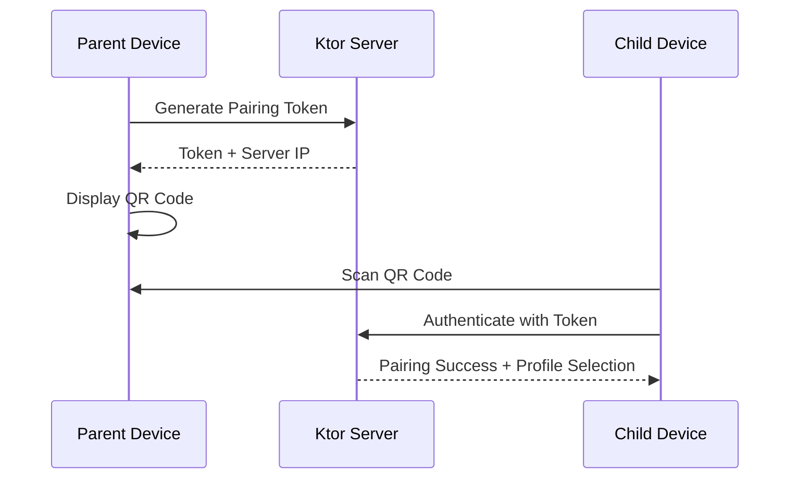
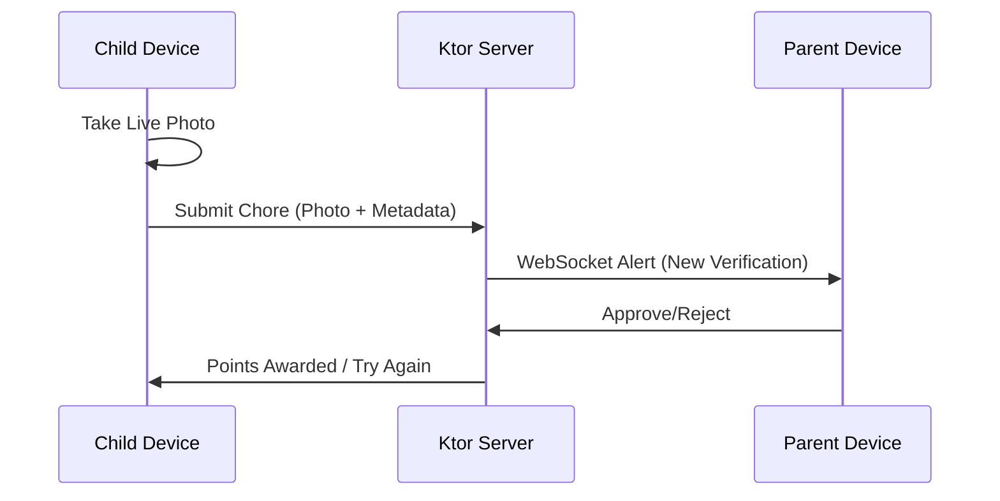
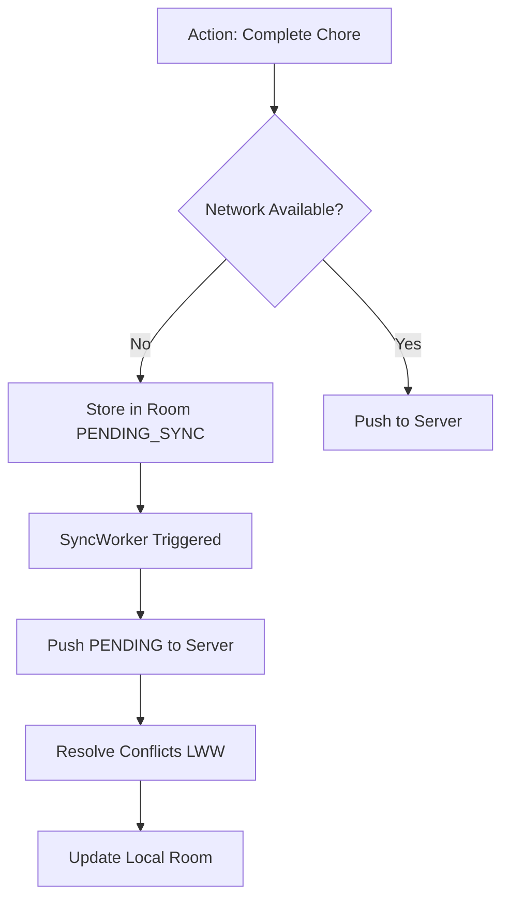

# FamilyChore: Full Project Reference & Master Plan
**Version: 1.0**

This document serves as the comprehensive "Source of Truth" for the **FamilyChore** project, consolidating vision, requirements, technical architecture, and the phased implementation roadmap.

---

## 1. Project Vision
FamilyChore is a high-engagement, gamified Kotlin Multiplatform (KMP) application designed to manage family chores locally and securely.
- **Privacy First**: No third-party cloud sync or analytics. Data stays on the home network.
- **Gamified Economy**: Points-based reward system with parental oversight.
- **Offline-First**: Mobile clients work without active internet, syncing with the local Ktor server when available.

---

## 2. Technical Stack
- **Languages**: Kotlin (100%).
- **UI**: Compose Multiplatform (Android, iOS, JVM).
- **Architecture**: MVI (State, Action, Event) with a strict Root/Screen composable split.
- **Dependency Injection**: Koin.
- **Database**: Room KMP (Single Source of Truth).
- **Networking**: Ktor (Client & Server) + WebSockets for real-time alerts.
- **Build System**: Gradle with custom Convention Plugins in `:build-logic`.
- **Testing**: JUnit5, AssertK, Turbine, Ktor MockEngine.

---

## 3. Core Architectural Principles
1. **Multi-Tenancy**: Every database entity and API request is scoped via `familyId`.
2. **Role-Based UX**: The app binary is unified, but UI branches into `Parent` or `Child` dashboards upon authentication.
3. **SSOT**: Room is the single source of truth; networking only updates the database.
4. **Local Network Discovery**: Automated scanning (mDNS) or QR-based IP exchange for server pairing.

---

## 4. Architecture Diagrams

### A. Phased Onboarding (QR Handshake)

### B. Chore Verification Flow

### C. Offline-First Sync

---

## 5. Detailed Implementation Roadmap

### Phase 1-5: Foundation (COMPLETED)
- Build logic, `Result` wrappers, `SafeCall`, `UiText`, and Room/Ktor factory setup.

### Phase 6: Onboarding & Secure Pairing (COMPLETED)
- **Server Discovery**: Automated search (mDNS/LAN) and IP caching for seamless server connection.
- **QR-based pairing handshake**: Real-time camera scanning for device linking.
- **Family creation flow**: Parent-driven family initialization.
- **Profile selection and PIN-based authentication**: Setup & Verify modes with 4-digit security.
- **Full unit test coverage**: All Auth features verified.

### Phase 6.5: Smart Startup & Connectivity (COMPLETED)
- **Health-Aware Startup**: Perform fast health check on cached server URL before navigating.
- **Shared Device Readiness**: Startup always flows to **User Selection (Profile Picker)** if the server is healthy, ensuring a fresh user context.
- **Real-time Connectivity**: Global `isServerReachable` monitor using **Kermit** for unified logging and state tracking.
- **Graceful Fallback**: Re-entry to Server Discovery if the cached server is offline.

### Phase 6.6: Server-Side Persistence (COMPLETED)
- **SQLite Database**: Migrated server from volatile in-memory storage to a persistent SQLite file using **Exposed** ORM.
- **Auto-Schema**: Automatic table creation for Families, Users, and PINs on server startup.
- **HikariCP**: Integrated connection pooling for robust server performance.

### Phase 7: The Points Economy (ACTIVE)
- **Goal**: Implement the core token economy.
- **Scope**: `Transaction` models, `TransactionRepository`, and Parent/Child Dashboards showing point balances and history.
- **Offline Dashboard**: First implementation of offline-ready dashboard with cached data (Deferred from 6.5).

### Phase 8: Task Management
- **Goal**: Core chore functionality.
- **Scope**: Chore assignment (Parent), task list viewing (Child), and live-photo-only verification submission.

### Phase 9: Behavioral Ledger (Dos & Don'ts)
- **Goal**: Spontaneous feedback system.
- **Scope**: UI for parents to quickly award bonus points (Dos) or apply penalties (Don'ts) outside of chores.

### Phase 10: Reward Store
- **Goal**: Point redemption.
- **Scope**: Custom reward creation (Parent) and redemption requests (Child) requiring parent approval.

### Phase 11: Real-time Sync & Background Workers
- **Goal**: Robustness and liveness.
- **Scope**: WebSocket integration for instant notifications and platform-specific workers (WorkManager/BGTasks) for background data integrity.

---

## 6. Domain Rules
- **Live Photo Only**: Chore verification MUST use a live camera photo (no gallery uploads).
- **Parental Override**: Parents can reset any child's PIN and override chore states.
- **LWW Resolution**: Conflict resolution defaults to Last Write Wins (LWW) based on entity versioning.
