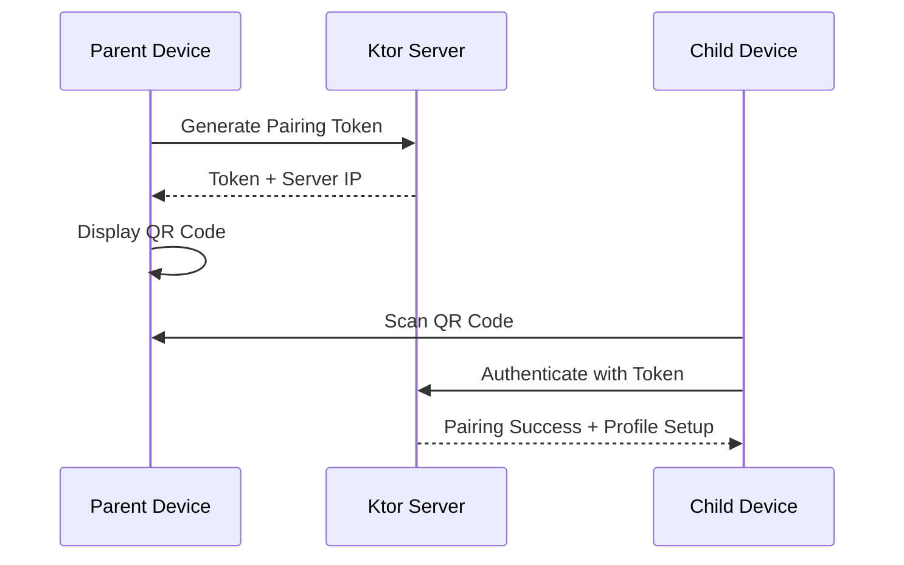
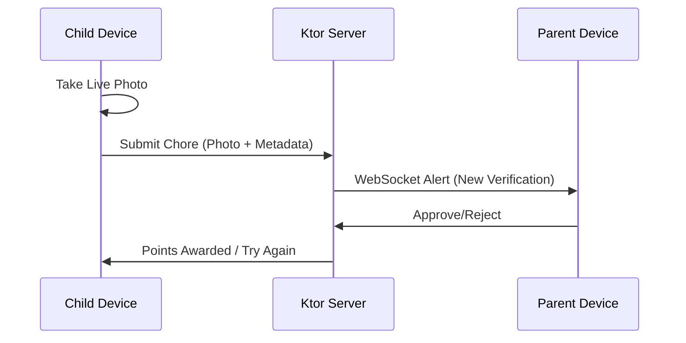
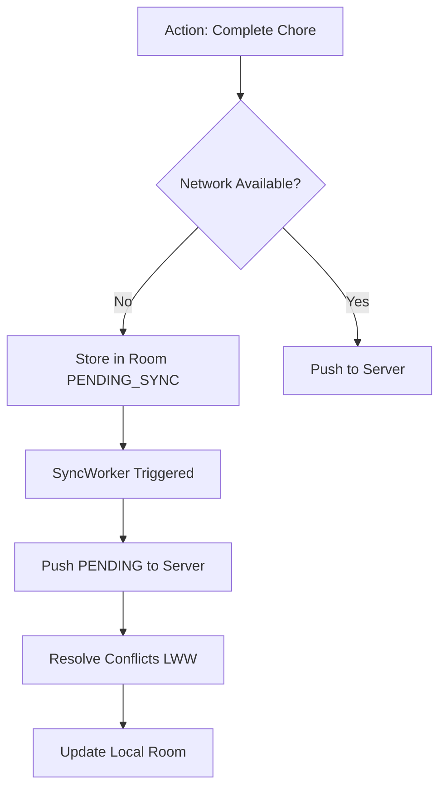

# FamilyChore App: The Ultimate Implementation Blueprint
**Revision: 1.2**

This document serves as the comprehensive, self-contained technical specification and implementation plan for the **FamilyChore** application.

## 1. Project Vision
A high-engagement, gamified KMP application for managing family chores.
- **Backbone**: Local Ktor server (Home Lab/Server).
- **Clients**: Android, iOS (Compose Multiplatform), and Web (Wasm).
- **Core Value**: Offline-first, privacy-focused, local network synchronization, and asymmetric gamification.

---

## 2. Project Knowledge Management & Critical Decisions

To ensure continuity across development sessions and provide agents with a high-fidelity context without relying on transient memory:

### A. The `MEMORY.md` Protocol
A `MEMORY.md` file will be maintained in the project root. Every time a major architectural decision is made or a platform-specific hurdle is overcome, it MUST be recorded here.
- **Decision Log**: Record "Why" (e.g., "Why Room KMP over SQLDelight?").
- **Domain Rules**: Explicitly list business logic (e.g., "Chore photos must be live-only").
- **Platform Quirks**: Notes on iOS/Web/Desktop behavior (e.g., "Wasm target requires special Linker flags").

### B. Critical Engineering Decisions (Principal Review Summary)
1. **Role-Based UX**: The app binary is unified, but the UI is a total branch. `Parent` dashboard vs. `Child` dashboard is decided at the entry point via `UserRole` enum.
2. **Offline-First**: Room KMP is the **Single Source of Truth**. Networking code (Ktor) only updates the database. The UI only observes the database.
3. **Data Sovereignty (COPPA)**: No third-party analytics or cloud sync. The Ktor server is the family's private hub. Nicknames only.
4. **Sync Strategy**: WebSocket for live updates + Platform Workers for background integrity.
5. **Conflict Resolution**: Version-based Last Write Wins (LWW) is the default; manual resolution for chore completion/approval state collisions.
6. **Build Infrastructure**: We will use **Gradle Convention Plugins** in a `:build-logic` module. No direct dependency management in feature `build.gradle.kts` files.
7. **Strict MVI & UI Split**: Every screen MUST be split into a **Root** (logical/DI) and **Screen** (dumb UI) composable. ViewModels MUST follow the `State`, `Action`, `Event` pattern.
8. **Multi-Tenant Scoping**: Every database entity and server-side request MUST be scoped via `familyId`. The Ktor server will embed this in the JWT payload.

### C. Plan & Artifact Mirroring
To ensure the implementation plan and key artifacts are versioned and accessible within the codebase:
- The final approved `implementation_plan.artifact.md` will be mirrored to the project root at `/artifacts/implementation_plan.md`.
- All design diagrams and ADRs (Architecture Decision Records) will be stored in the project's `/artifacts/` directory.

---

## 3. Core Feature Requirements

### A. Authentication & Role-Based UX
- **User Personas**: Distinct `Parent` and `Child` dashboards in a single app binary.
- **Primary Auth**: 4-digit PIN per user profile (Optional for child profiles to support younger children).
- **Pairing**: Secure QR-based handshake to exchange server IP/Port and initial pairing tokens.
- **Security**: Role-based access control (RBAC) enforced on the Ktor server.
- **Recovery Paths**:
    1. **Parent Recovery Secret**: Security facts set during onboarding.
    2. **Parent-to-Child**: Parents can override and reset any child's PIN.
    3. **Server-Side Fallback**: CLI or protected endpoint on the Ktor server to reset settings or PINs.

### B. The Gamification Engine
- **Token Economy**: Points are the central currency.
- **Task Verification**: Child marks "Complete" (Mandatory Live Camera Photo) -> Parent receives WebSocket alert -> Parent "Approves" -> Points awarded.
- **Behavioral Ledger**:
    - **Dos**: Spontaneous bonus points for good behavior (Green).
    - **Don'ts**: Immediate penalties for infractions (Red).

### C. Task & Reward Management
- **Personalized Chores**: Assigned to specific children; individual task lists.
- **Frequencies**: Daily, Weekly, Monthly, and One-off.
- **Deadline Penalties**: Optional point deduction if a chore is missed.
- **Vacation Mode**: Admin toggle to pause deadline penalties globally.
- **Reward Store**: Custom rewards with images. Redemption requires parental approval.

### D. Verification & Profile Customization
- **Strict Photo Policy**: Verification photos for chores **must** be taken live.
- **Profiles**: Children can set a profile picture via live selfie OR choose from default avatar sets (monsters/animals).

### E. Connectivity, Synchronization & Offline-First
- **Offline-First Strategy**: Room KMP as the local source of truth.
- **Conflict Resolution**: Last Write Wins (LWW) with `version` tracking; Manual Merge UI for critical mismatches.
- **Discovery**: Automated local network scanning (mDNS).
- **Server Health**: Real-time "Green Dot" indicator (Heartbeat).
- **Background Sync**: Platform-specific workers (WorkManager/BGTasks) keep local Room DB in sync.
- **Asynchronous UI**: Loading, Success, Error, and Retry states for all interactions.

### F. Privacy, Compliance (COPPA) & Debugging
- **Data Sovereignty**: Local Ktor server keeps PII within the home network.
- **Minimal Data**: No email/phone for children; nicknames only.
- **Audit Log**: Every point transaction and setting change is logged with Device Metadata.
- **Local Dumps**: Export debug logs and server state (JSON) to local storage.

### G. Multi-Family Support
- **Server-Side Isolation**: The Ktor server must support hosting multiple independent families. Each family’s data (chores, rewards, points) is isolated via a `familyId`.
- **App-Side Multi-Tenancy**: The application must support belonging to multiple families. Users can switch between family contexts within the app.
- **Pairing**: The QR handshake will now include a `familyId` to ensure the device is paired to the correct family context.

---

## 4. Architecture Diagrams

### A. Phased Onboarding (QR Handshake)


### B. Chore Verification Flow


### C. Offline-First Sync


---

## 5. Proposed Changes

### Build Infrastructure
We will establish a scalable build system using Gradle Convention Plugins.

#### [NEW] [:build-logic](file:///Users/aalsamman/AndroidProjects/FamilyChore/build-logic)
Create convention plugins for `android-feature`, `compose`, `room`, `ktor`, and `koin` to ensure consistency across all modules.

### Core Module Setup
We need to establish the shared architecture in the `:core` subprojects following established KMP best practices.

#### [NEW] [Result.kt](file:///Users/aalsamman/AndroidProjects/FamilyChore/core/src/commonMain/kotlin/org/aals/family/chore/core/domain/util/Result.kt)
Generic Result wrapper and error handling helpers.
```kotlin
interface Error

sealed interface Result<out D, out E : Error> {
    data class Success<out D>(val data: D) : Result<D, Nothing>
    data class Error<out E : org.aals.family.chore.core.domain.util.Error>(val error: E) : Result<Nothing, E>
}

sealed interface DataError : Error {
    enum class Network : DataError {
        NO_INTERNET, SERVER_ERROR, UNAUTHORIZED, UNKNOWN
    }
    enum class Local : DataError {
        DISK_FULL, UNKNOWN
    }
}

typealias EmptyResult<E> = Result<Unit, E>
```

#### [NEW] [UiText.kt](file:///Users/aalsamman/AndroidProjects/FamilyChore/core/src/commonMain/kotlin/org/aals/family/chore/core/presentation/UiText.kt)
Resource-aware string wrapper.
```kotlin
sealed interface UiText {
    data class DynamicString(val value: String) : UiText
    class StringResource(
        val id: StringResource,
        val args: Array<Any> = emptyArray()
    ) : UiText

    @Composable
    fun asString(): String {
        return when (this) {
            is DynamicString -> value
            is StringResource -> stringResource(id, *args)
        }
    }
}
```

### Data Layer (Multi-Tenant & Offline-First)
Setting up the shared database with family-based isolation.

#### [NEW] [FamilyDatabase.kt](file:///Users/aalsamman/AndroidProjects/FamilyChore/core/src/commonMain/kotlin/org/aals/family/chore/core/data/local/FamilyDatabase.kt)
Room database definition for KMP. Every entity includes a `familyId`.
```kotlin
@Database(
    entities = [ChoreEntity::class, UserEntity::class],
    version = 1
)
abstract class FamilyDatabase : RoomDatabase() {
    abstract fun choreDao(): ChoreDao
    abstract fun userDao(): UserDao
}

@Entity(primaryKeys = ["id", "familyId"])
data class ChoreEntity(
    val id: String,
    val familyId: String, // Scoping
    val title: String,
    val isCompleted: Boolean,
    val version: Long
)
```

---

## 6. Technical Stack
- **UI**: Compose Multiplatform (M3, Dark Mode, RTL Arabic Support).
- **Navigation**: Type-Safe Compose Navigation (@Serializable routes).
- **Dependency Injection**: Koin.
- **DB**: Room KMP (Multi-tenant scoped via `familyId`).
- **Sync**: Ktor WebSockets & Platform Workers (WorkManager/BGTasks).
- **Interop**: SKIE (Swift Kotlin Interface Enhancer) for iOS.
- **Resources**: JB Compose Resources API.

---

## 6. Verification Plan
- **Automated**: Audit log integrity, Sync conflict resolution, Auth recovery flows.
- **Manual**: RTL mirroring, Strict Camera enforcement, Vacation Mode validation.
